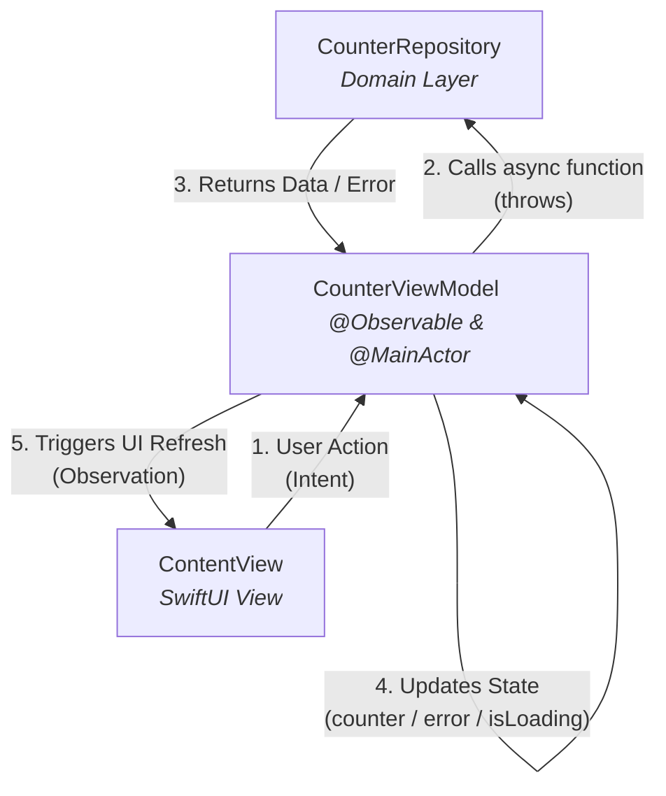

# iOSCounterApp

A learning project to learn iOS with SwiftUI coming from Flutter and Android.

Utilities:

* [Clean Architecture](./docs/CLEAN_ARCHITECTURE.md)
* [Concurrency in Swift](./docs/CONCURRENCY.md)
* [New Swift Package](./docs/CREATE_SWIFT_PACKAGE.md)
* [New no code file](./docs/CREATING_FILES.md)
* [XCode Shortcuts](./docs/SHORTCUTS.md)

# 🧠 Architecture Comparison: iOS vs. Android & Flutter

Coming from **Android (Compose/StateFlow)** or **Flutter (Riverpod/Bloc)**, the way SwiftUI handles state can feel different. Here is the direct mapping of the concepts currently used in this project:

## 1. State Management Analogy

| Concept | SwiftUI (`@Observable`) | Flutter (`ChangeNotifier`) | Android (`Compose`) |
| :--- | :--- | :--- | :--- |
| **Mechanism** | Individual properties in a class. | Individual properties in a class. | Multiple `mutableStateOf`. |
| **Notification** | Automatic (via `@Observable`). | Manual (`notifyListeners()`). | Automatic (via `State`). |
| **Subscription** | The View "reads" and subscribes. | `ListenableBuilder` or `ref.watch`. | The Composable reads the `State`. |

## 2. The "Culture Shock": Observation vs. Streams

In **Android/Compose**, you usually deal with a `StateFlow`—an explicit stream of immutable states. 

In **iOS (Classic SwiftUI)**:
* There is no explicit "Stream" by default. 
* The **ViewModel** is a **living object** that the View observes property by property.
* **Granularity:** If you change `isLoading`, SwiftUI only re-evaluates the parts of the `body` that read that specific variable.

## 3. Single State (MVI/UDF) vs. Multiple Properties (Observation)

While the "classic" iOS way uses multiple properties (**as seen in the previous PR of this project**), using a **Single State Enum** is the standard for robust software engineering:

* **Classic Way (Current):** Uses `var counter: Int?` and `var activeError: ErrorData?`.
    * *Risk:* Possible "impossible states" (e.g., showing a loader and an error at the same time).
* **Unidirectional Data Flow (UDF) Way (State Machine):** Uses an `enum CounterState { case loading, success(Int), error(ErrorData) }`.
    * *Benefit:* Forced exhaustive handling with `switch` statements and zero "impossible states."

## 4. Memory Management & Safety

* **@MainActor:** Ensures all UI updates happen on the Main Thread (equivalent to `withContext(Dispatchers.Main)` or `MainThread` annotation).
* **Task Management:** Using `.task` in the View automatically handles cancellation when the view disappears (similar to `viewModelScope` or `cancelable` in Flutter).
* **Strong vs Weak References:** In ViewModels (Classes), we use `[weak self]` in asynchronous tasks to prevent memory leaks, ensuring the ViewModel can be deallocated if the user navigates away.




# Asynchronous Task Management
In this project, we handle asynchronous operations using **Swift’s Structured Concurrency**. Below is the rationale for how we manage the task lifecycle, specifically tailored for developers coming from Android (Kotlin Coroutines) or Flutter (Bloc/Provider).

## 1. Simple Case: `MainActor` Inheritance.

For simple actions (like incrementing a counter), we launch a `Task` directly within the `ViewModel`:

```swift
@Observable @MainActor
class ViewModel {
    var counter: Int = 0

    func increment() {
        Task { // 🚨 Inherits @MainActor context
            let newValue = await repository.increment()
            self.counter = newValue // Safe UI update
        }
    }
}
```

* **Why it works**: In Swift, `Task { }` (an unstructured task) inherits the execution context of its surroundings. Since the `ViewModel` is annotated with `@MainActor`, any `Task` created inside its methods automatically runs on the **Main Actor**. <u>This guarantees that state updates (like counter = newValue) are thread-safe and performed on the Main Thread without explicit dispatching</u>.

* **The "Simple" Factor**: For quick operations, we rely on the task finishing almost instantly. The risk of memory leaks or significant "zombie" tasks is minimal.

* **Thread Safety**: This guarantees that state updates are thread-safe and performed on the Main Thread without needing explicit dispatching (like Android's `withContext(Dispatchers.Main)` or `DispatchQueue.main.async)`).

* **Note on Detached Tasks**: Using `Task.detached { }` would bypass this inheritance, sending the work to the **"Global Concurrent Pool"** (Background), requiring a return to the Main Actor for UI updates.

## 2. Advanced Case: Manual Cancellation & `deinit`.

In complex scenarios (e.g., long-running network requests, file uploads, or heavy data processing), we must prevent tasks from running if the **user navigates away from the screen**.

🚨 In Swift, unlike Android's viewModelScope, a Task launched inside a method <u>**does not automatically cancel when the ViewModel is deallocated**</u>. To handle this, we <u>**implement manual tracking**</u>:

```swift
@Observable @MainActor
final class ComplexViewModel {
    private var pendingTask: Task<Void, Never>?

    func fetchData() {
        // 🚨 Cancel previous work if it's still running (Debouncing/Unique execution)
        pendingTask?.cancel() 
        
        pendingTask = Task {
            let result = await longRunningService.execute()
            
            if !Task.isCancelled {
                self.data = result
            }
        }
    }

    // 🚨 Equivalent to Android's onCleared() or Flutter's dispose()
    deinit {
        pendingTask?.cancel()
    }
}
```

## Key Takeaways
* **Simple Actions**: "Fire and forget" via `Task {}` is acceptable for local/fast operations.

* **Resource Intensive Actions**: Always store the `Task` reference and cancel it in `deinit` to avoid background resource waste.

* **UI-Bound Tasks**: For initial loading, prefer the **`.task` modifier** in the SwiftUI View, as it **provides automatic cancellation** out of the box if the user navigates away before the task completes.
