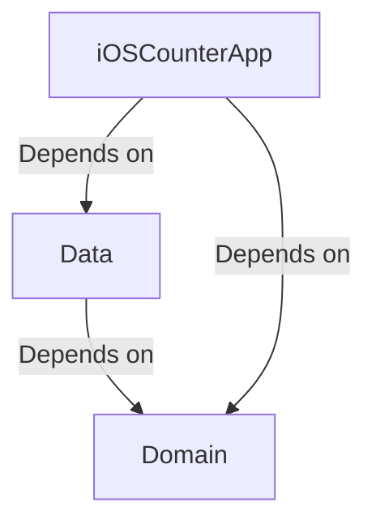
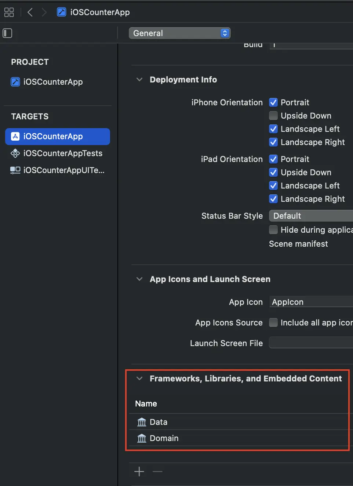
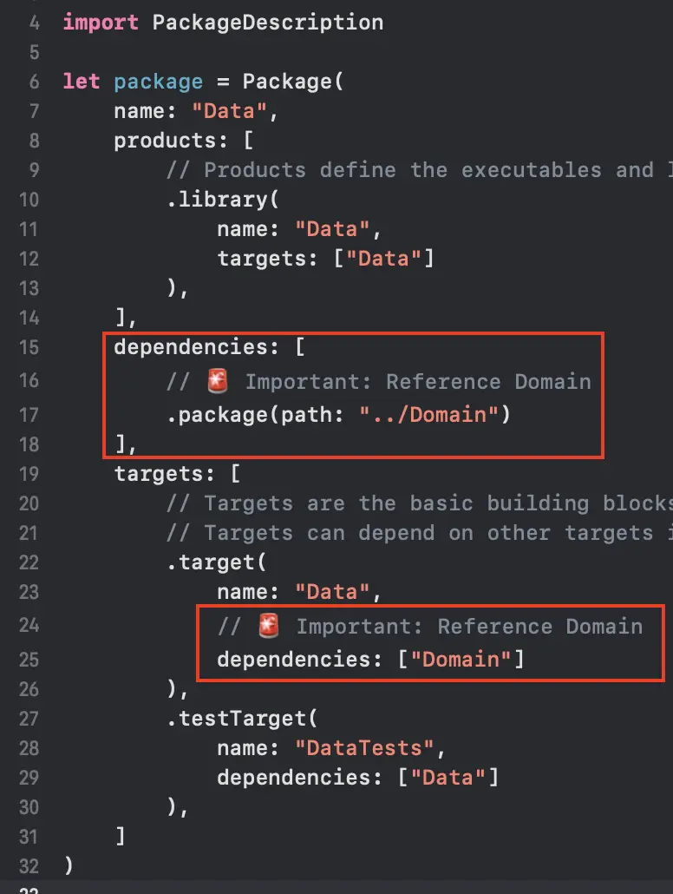

# Clean Architecture

1. Make sure that `Domain` and `Data` are listed in `Frameworks, Libraries, and Embedded Content`.

2. Make sure that `Data`'s `Packages.swift` adds `Domain` as **Package** and **Target dependency**.

3. Clean & Build by pressing <kbd>Cmd</kbd> + <kbd>Shift</kbd> + <kbd>K</kbd> (Clean) and then <kbd>Cmd</kbd> + <kbd>B</kbd> (Build) to refresh the index.
