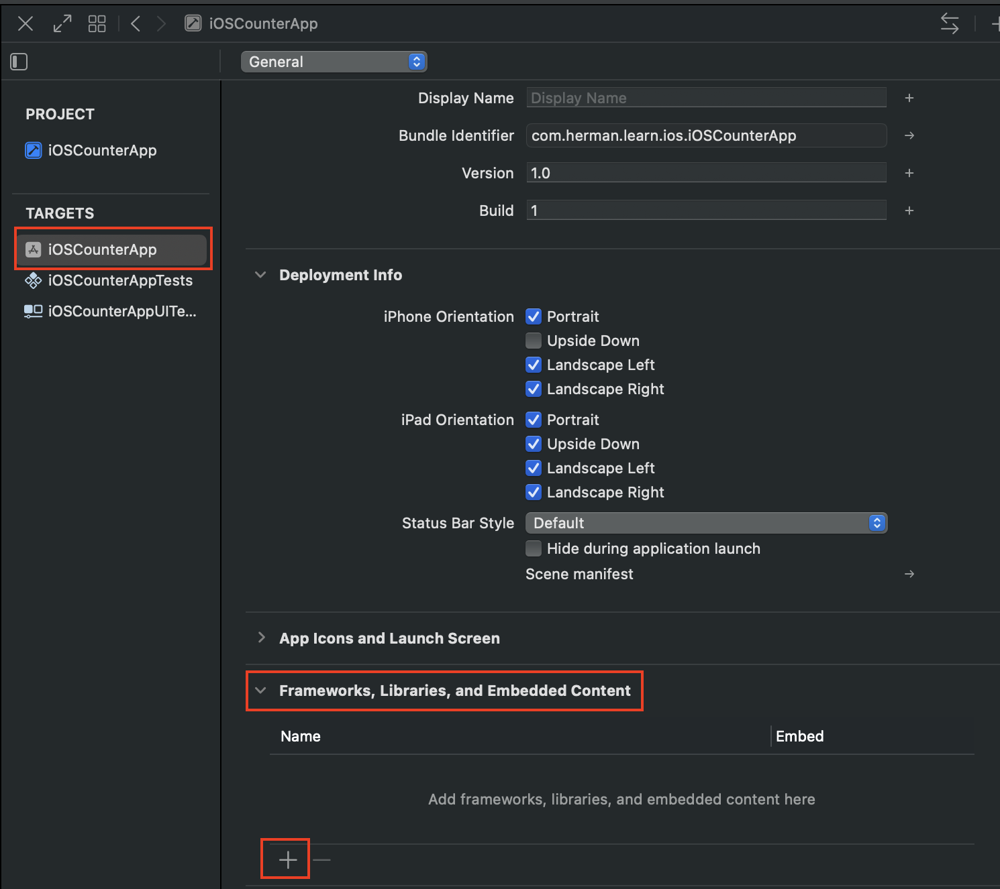
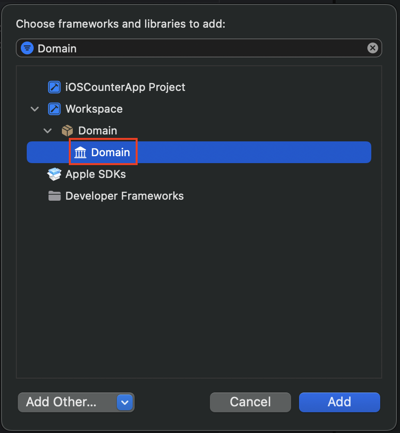

# Create Swift Package (e.g. Domain)
1. Go to File > New > Package....
2. Save it in the root folder of your project (alongside the .xcodeproj file), not inside your app's source folder.
3. In the "Add to" dropdown during the save dialog, select your iOSCounterApp project. This turns the folder into a Box icon (📦) in Xcode.
4. Inside the package, you must use the public keyword for any protocol, struct, or init you want to access from the App.

## Connect the new Package to the App Target
You must explicitly tell your App to "import" this binary, similar to adding a dependency in pubspec.yaml or build.gradle.
1. Select Project: Click the blue iOSCounterApp project icon at the top of the Navigator.
2. Select Target: Choose your iOSCounterApp target.
3. General Tab: Scroll down to Frameworks, Libraries, and Embedded Content.
4. Add (+) : Click the plus button, search for your Domain library, and add it.

 

5. To verify, add `import Domain` to `ContentView.swift` and Clean & Build by pressing <kbd>Cmd</kbd> + <kbd>Shift</kbd> + <kbd>K</kbd> (Clean) and then <kbd>Cmd</kbd> + <kbd>B</kbd> (Build) to refresh the index.
